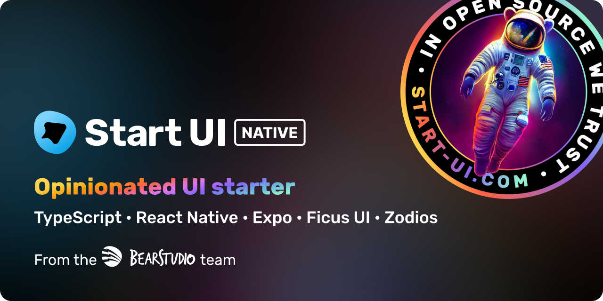

<h1 align="center"></h1>

🎮 **Kuala Animations** is a React Native animation showcase app built with [Expo](https://expo.dev/) and [React Native Reanimated](https://docs.swmansion.com/react-native-reanimated/). This project demonstrates various animation techniques using Pokemon as interactive elements.

This app features a comprehensive collection of smooth animations including flat list transitions, falling animations, transform effects, and interactive Pokemon-based animations - all powered by local assets for optimal performance.

---

## ✨ Features

### 🎯 Animation Showcase
- **Flat List Animations**: Interactive list transitions with Pokemon teams
- **Flat List Row Animations**: Row-based list animations with spring effects  
- **Falling Pokemon**: Continuous falling animation with random properties
- **Pokemon Move**: Touch-based horizontal movement animations
- **Pokemon Rotate**: 360-degree rotation animations on tap
- **Pokemon Transform**: Evolution animations with size and opacity transitions

### 🖼️ Asset Management
- **100 Local Pokemon Images**: High-quality Pokemon assets (001-100)
- **Random Selection**: Different Pokemon appear each animation session
- **Optimized Performance**: Local assets for faster loading and offline capability

### 🎨 UI/UX
- **Dark Mode Support**: Seamless light/dark theme switching
- **Responsive Design**: Optimized for various screen sizes
- **Smooth Transitions**: 60fps animations with React Native Reanimated
- **Interactive Elements**: Touch-based animations and gestures

---

## Technology Stack

- 🚀 [Expo SDK 52](https://expo.dev/)
- 📱 [Expo EAS](https://expo.dev/eas)
- ⚛️ [Expo Router 4](https://expo.github.io/router/docs/)
- 🎬 [React Native Reanimated 3](https://docs.swmansion.com/react-native-reanimated/)
- 🌿 [Ficus UI](https://ficus-ui.com/)
- 🐜 [Formiz](https://formiz-react.com/)
- ↔ [Zodios](https://www.zodios.org/)

---

## 🚀 Getting Started

### Prerequisites

This app uses Expo with [Expo development builds](https://docs.expo.dev/workflow/overview/#development-builds). To run the animations, you'll need to install Android and iOS development tools:

#### Android

See https://reactnative.dev/docs/environment-setup?guide=native&platform=android

#### iOS

See https://reactnative.dev/docs/environment-setup?guide=native&platform=ios

### Installation & Setup

```bash
# Clone the repository
git clone https://github.com/omar-bear/kuala-reanimated.git
cd kuala-reanimated

# Install dependencies
pnpm install
```

### Environment Configuration

Create a `.env` file with your API configuration:

```env
# API endpoint configuration
API_URL='your api url here'
OPEN_API_URL='your open api url here'
AUTH_BASE_URL='your auth base url here'
BETTER_AUTH_OPEN_API='your better auth api url here'
MODE='development'
```

### Example demo configuration
```env
API_URL='https://start-ui-web-restart.vercel.app/api/rest'
OPEN_API_URL='https://start-ui-web-restart.vercel.app/api/openapi/app/schema'
AUTH_BASE_URL='https://start-ui-web-restart.vercel.app/api/auth'
BETTER_AUTH_OPEN_API='https://start-ui-web-restart.vercel.app/api/openapi/auth/schema'
MODE="DEV"

```

### Development

```bash
# Run the app in development mode
pnpm dev

# Platform-specific development
pnpm android # Launch on Android device/emulator
pnpm ios     # Launch on iOS device/emulator

# Run with Expo Go
pnpm dev
# * Press 's' to switch to Expo Go
# * Scan the QR Code with your phone
```

## 🎮 Animation Guide

### Available Animations

1. **Flat List Animation** (`/animations/flat-list-animation`)
   - Interactive Pokemon team management with smooth transitions
   - Drag Pokemon between two teams with layout animations
   - Uses 16 random Pokemon (8 per team) for optimal performance

2. **Flat List Row Animation** (`/animations/flat-list-row-animation`)
   - Row-based list with spring animations
   - Pokemon movement between teams with row transitions
   - Clean list interface with Pokemon details

3. **Falling Pokemon** (`/animations/falling-pokemon`)
   - Continuous falling animation with 6 random Pokemon
   - Random size, rotation, and positioning
   - Infinite loop with staggered timing

4. **Pokemon Move** (`/animations/pokemon-move`)
   - Simple horizontal movement on tap
   - Uses a random Pokemon each session
   - Demonstrates basic translation animations

5. **Pokemon Rotate** (`/animations/pokemon-rotate`)
   - 360-degree rotation animation on tap
   - Smooth rotation transforms
   - Continuous rotation accumulation

6. **Pokemon Transform** (`/animations/pokemon-transform`)
   - Evolution-based transformation (Charmander → Charmeleon → Charizard)
   - Size and opacity transitions
   - Demonstrates complex state-based animations

### Animation Features

- **60fps Performance**: Smooth animations using React Native Reanimated
- **Random Pokemon**: Different Pokemon appear each session for variety
- **Local Assets**: 100 Pokemon images stored locally for optimal performance
- **Dark Mode**: All animations support light and dark themes
- **Responsive**: Animations adapt to different screen sizes

---

## 📱 Storybook Integration

Kuala Animations includes Storybook for component development and testing in an isolated environment.

### Running Storybook

```bash
# Launch Storybook mode
pnpm storybook

# Launch normal app mode
pnpm start
```

### Component Stories

Stories are created alongside components in `ComponentName.stories.tsx` files, keeping components and their documentation tightly coupled for better maintainability.

---

## 🛠️ Scripts

```

### Development

```bash
# Lint and fix code
npx expo lint --fix

# Type checking
npx tsc --noEmit

# Build for production
npx expo build
```

---

## 📁 Project Structure

```
kuala-animations/
├── app/                          # Expo Router pages
│   ├── (app)/
│   │   └── animations/          # Animation showcase pages
│   ├── (auth)/                  # Authentication pages
│   └── storybook/               # Storybook integration
├── assets/
│   └── pokemons/               # 100 Pokemon images (001-100.png)
├── src/
│   ├── components/             # Reusable UI components
│   ├── constants/
│   │   └── pokemons.ts        # Pokemon data with local imports
│   ├── modules/
│   │   └── pokemons/          # Pokemon-specific components
│   └── theme/                 # Theme configuration
└── scripts/                   # Asset generation scripts
```

---

## 🎯 Performance Optimizations

- **Local Assets**: All Pokemon images stored locally for instant loading
- **Random Sampling**: Animations use limited Pokemon sets (6-16) for optimal performance  
- **React Native Reanimated**: Native-thread animations for 60fps performance
- **Lazy Loading**: Components loaded on-demand with Expo Router
- **Optimized Images**: PNG assets optimized for mobile devices

---

## 🔧 [Expo EAS Builds](https://docs.expo.dev/build/introduction/)

> EAS Build is a hosted service for building app binaries for your Expo and React Native projects.

[Follow these steps to setup EAS CLI](https://docs.expo.dev/build/setup/#prerequisites).

### Building for Production

```bash
# Build for Android
eas build --platform android

# Build for iOS  
eas build --platform ios

# Build for both platforms
eas build --platform all
```

---

## 🤝 Contributing

1. Fork the repository
2. Create a feature branch (`git checkout -b feature/amazing-animation`)
3. Commit your changes (`git commit -m 'Add amazing animation'`)
4. Push to the branch (`git push origin feature/amazing-animation`)
5. Open a Pull Request

---

## 📄 License

This project is licensed under the MIT License - see the [LICENSE](LICENSE) file for details.

---

## 🎨 Credits

- **Pokemon Assets**: Official Pokemon images from The Pokemon Company
- **Animations**: Built with React Native Reanimated
- **UI Framework**: Ficus UI for consistent design
- **Base Template**: Originally based on Start UI Native by BearStudio